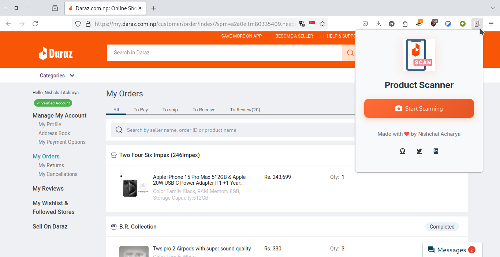
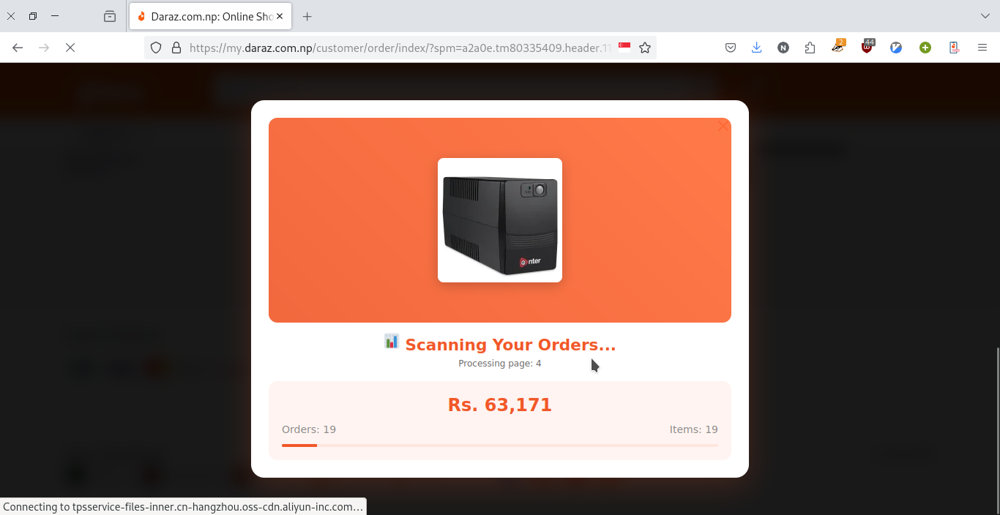
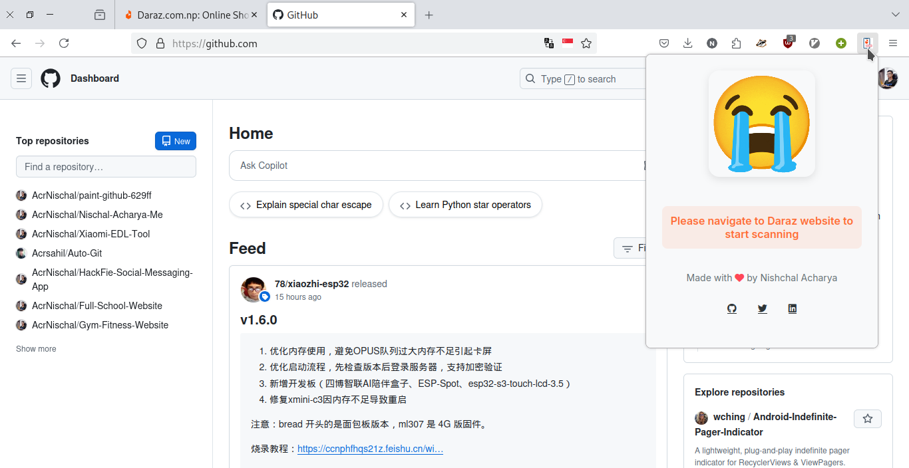

# 🛍️ Daraz Spend Tracker

**Easily track how much you’ve spent on Daraz so far!**

---

<p align="center">
  <a href="https://addons.mozilla.org/addon/daraz-product-spend-tracker/">
    
  </a>
  <a href="#chrome-installation-guide">
    
  </a>
</p>

---

## 📦 About
This extension helps you easily track how much you’ve spent on Daraz over time. Just click the extension icon while on Daraz, hit **Start Scan**, and it’ll analyze your orders to calculate your total spending. Super useful if you’re trying to manage your budget or just curious where your money’s gone!

---

## 🚀 Features
- 📊 View total amount spent on Daraz
- 🖱️ One-click scan to calculate order history
- 🧠 Works only when you open it and press “Start Scan”
- 🛍️ Helpful for budget tracking and expense awareness

---

## 🛠️ Installation

### 🦊 Firefox
1. Go to [Firefox Add-on Page](https://addons.mozilla.org/addon/daraz-product-spend-tracker/) and click **Add to Firefox**

### 🧩 Chrome
1. Go to [Chrome Extension Page](https://chromewebstore.google.com/detail/daraz-spend-lens/hdohnemeliomhdaaihfbggmlnnaljmjj) and click **Add to Chrome**

### 🦁 Brave
1. Go to [Brave Extension Page](https://chromewebstore.google.com/detail/daraz-spend-lens/hdohnemeliomhdaaihfbggmlnnaljmjj) and click **Add to Brave**

---

## 📂 Project Structure
```
Directory structure:
└── acrnischal-daraz-product-spend-tracker/
    ├── README.md
    ├── content.js
    ├── LICENSE
    ├── login_detect.js
    ├── manifest.json
    ├── nagivate_order.js
    ├── popup.html
    ├── popup.js
    ├── styles.css
    ├── images/
    └── screenshots/

```

---

## 📸 Screenshots
<p align="center">
  
  
  <br/>
  
  
</p>

---

## ❓ FAQ

### How does it work?
It scans your order history on Daraz and calculates your total spending based on the data.

### Is my data safe?
Yes, the extension works locally in your browser and doesn’t send data anywhere.

### Why does it need permission to access Daraz?
It needs access only to scan your order history and calculate spending — nothing more.

### Does it work on the mobile app?
Nope, it only works on the **desktop website** using Chrome or Firefox.

---

## 📜 License
Licensed under the **MIT License**. Feel free to fork, modify, or contribute.

---

## ✨ Author
**Nishchal Acharya**  
Made with ❤️ to simplify shopping on Daraz.

- 🌐 GitHub: [@AcrNischal](https://github.com/AcrNischal)

---

## 💬 Feedback
Found a bug? Have suggestions? [Open an issue](https://github.com/AcrNischal) or reach out to me. Let’s make shopping even easier together!
